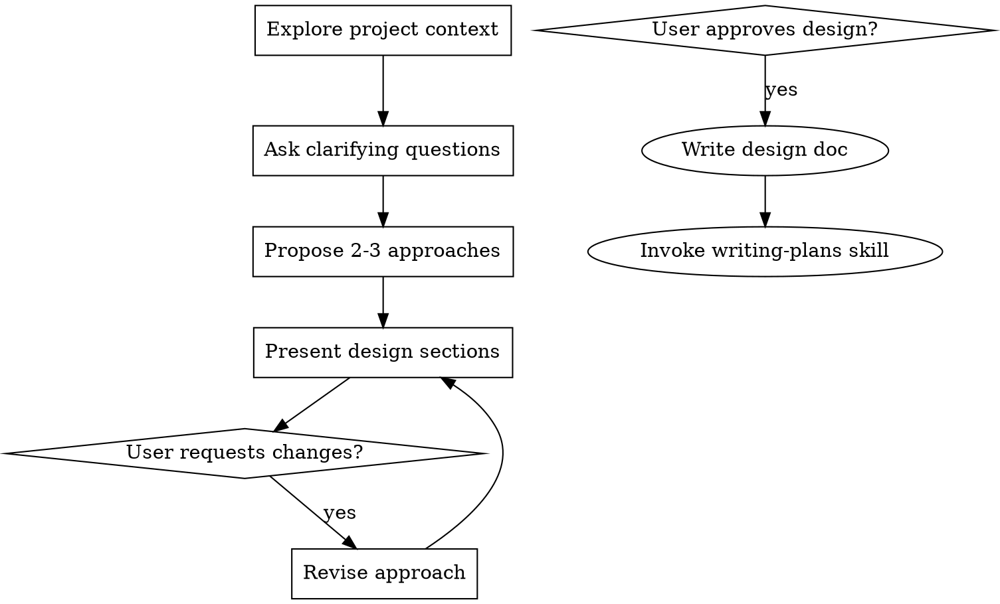

# Brainstorming Ideas Into Designs


## Contents

- [Overview](#overview)
- [Anti-Pattern: "This Is Too Simple To Need A Design"](#anti-pattern-this-is-too-simple-to-need-a-design)
- [Checklist](#checklist)
- [Process Flow](#process-flow)
- [When to Use](#when-to-use)
- [When NOT to Use](#when-not-to-use)
- [Phase 0: Assess Requirement Clarity](#phase-0-assess-requirement-clarity)
- [Phase 1: Understand the Idea](#phase-1-understand-the-idea)
- [Phase 2: Explore Approaches](#phase-2-explore-approaches)
- [Phase 3: Capture the Design](#phase-3-capture-the-design)
- [Phase 4: Handoff](#phase-4-handoff)
- [YAGNI Principles](#yagni-principles)
- [Anti-Patterns to Avoid](#anti-patterns-to-avoid)
- [Integration with Planning](#integration-with-planning)

## Overview

Help turn ideas into fully formed designs and specs through natural collaborative dialogue.

Start by understanding the current project context, then ask questions one at a time to refine the idea. Once you understand what you're building, present the design and get user approval.

<HARD-GATE>
Do NOT invoke any implementation skill, write any code, scaffold any project, or take any implementation action until you have presented a design and the user has approved it. This applies to EVERY project regardless of perceived simplicity.
</HARD-GATE>

## Anti-Pattern: "This Is Too Simple To Need A Design"

Every project goes through this process. A todo list, a single-function utility, a config change — all of them. "Simple" projects are where unexamined assumptions cause the most wasted work. The design can be short (a few sentences for truly simple projects), but present it and get approval.

## Checklist

create a task for each of these items and complete them in order:

1. **Explore project context** — check files, docs, recent commits
2. **Ask clarifying questions** — one at a time, understand purpose/constraints/success criteria
3. **Propose 2-3 approaches** — with trade-offs and your recommendation
4. **Present design** — in sections scaled to their complexity, get user approval after each section
5. **Write design doc** — save to `docs/plans/YYYY-MM-DD-<topic>-design.md` and commit
6. **Transition to implementation** — invoke writing-plans skill to create implementation plan

## Process Flow



**The terminal state is invoking writing-plans.** Do NOT invoke frontend-design, mcp-builder, or any other implementation skill. The ONLY skill you invoke after brainstorming is writing-plans.

## When to Use

- Requirements are unclear or ambiguous
- Multiple valid approaches could solve the problem
- Trade-offs need exploration with the user
- Feature scope needs refinement before planning
- The user used vague terms like "make it better" or "add something like"

## When NOT to Use

- Requirements are explicit with acceptance criteria
- The task is a straightforward bug fix
- The user knows exactly what they want and stated it clearly
- Scope is already constrained and well-defined

## Phase 0: Assess Requirement Clarity

Before diving into questions, assess whether brainstorming is needed.

**Signals that requirements are clear:**
- User provided specific acceptance criteria
- User referenced existing patterns to follow
- User described exact behavior expected

**Signals that brainstorming is needed:**
- User used vague terms ("make it better", "add something like")
- Multiple reasonable interpretations exist
- Trade-offs haven't been discussed

If requirements are clear, suggest: "Your requirements seem clear. Consider proceeding directly to planning."

## Phase 1: Understand the Idea

Ask questions **one at a time** to understand the user's intent. Never dump five questions in a single message.

**Question Techniques:**

1. **Prefer multiple choice when natural options exist**
   - Good: "Should the notification be: (a) email only, (b) in-app only, or (c) both?"
   - Avoid: "How should users be notified?"

2. **Start broad, then narrow**
   - First: What is the core purpose?
   - Then: Who are the users?
   - Finally: What constraints exist?

3. **Validate assumptions explicitly**
   - "I'm assuming users will be logged in. Is that correct?"

**Key Topics to Explore:**

| Topic | Example Questions |
|-------|-------------------|
| Purpose | What problem does this solve? What's the motivation? |
| Users | Who uses this? What's their context? |
| Constraints | Any technical limitations? Timeline? Dependencies? |
| Success | How will you measure success? What's the happy path? |
| Edge Cases | What shouldn't happen? Any error states to consider? |
| Existing Patterns | Are there similar features in the codebase to follow? |

**Exit Condition:** Continue until the idea is clear OR user says "proceed"

## Phase 2: Explore Approaches

After understanding the idea, propose 2-3 concrete approaches.

**Structure for Each Approach:**

```markdown
### Approach A: [Name]
[2-3 sentence description]

**Pros:** [Benefit 1], [Benefit 2]
**Cons:** [Drawback 1], [Drawback 2]
**Best when:** [Circumstances where this approach shines]
```

**Guidelines:**
- Lead with a recommendation and explain why
- Be honest about trade-offs
- Consider YAGNI—simpler is usually better
- Reference codebase patterns when relevant

## Phase 3: Capture the Design

Summarize key decisions in a structured format:

- **What we're building** (1-2 paragraphs)
- **Why this approach** (brief comparison with alternatives)
- **Key decisions** with rationale
- **Open questions** for the planning phase

**Output Location:** `docs/plans/YYYY-MM-DD-<topic>-design.md`

## Phase 4: Handoff

Present clear options:
1. **Proceed to planning** → Invoke writing-plans skill
2. **Refine further** → Continue exploring the design
3. **Done for now** → User will return later

## YAGNI Principles

During brainstorming, actively resist complexity:
- Don't design for hypothetical future requirements
- Choose the simplest approach that solves the stated problem
- Prefer boring, proven patterns over clever solutions
- Ask "Do we really need this?" when complexity emerges
- Defer decisions that don't need to be made now

## Anti-Patterns to Avoid

| Anti-Pattern | Better Approach |
|--------------|-----------------|
| Asking 5 questions at once | Ask one at a time |
| Jumping to implementation details | Stay focused on WHAT, not HOW |
| Proposing overly complex solutions | Start simple, add complexity only if needed |
| Ignoring existing codebase patterns | Research what exists first |
| Making assumptions without validating | State assumptions explicitly and confirm |

## Integration with Planning

Brainstorming answers **WHAT** to build:
- Requirements and acceptance criteria
- Chosen approach and rationale
- Key decisions and trade-offs

Planning answers **HOW** to build it:
- Implementation steps and file changes
- Technical details and code patterns
- Testing strategy and verification
