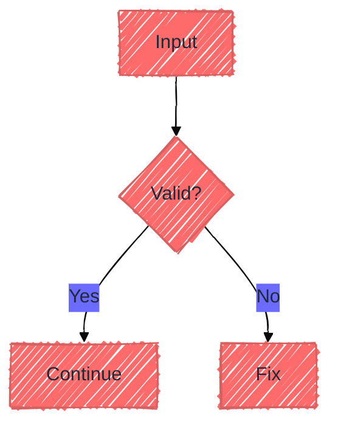
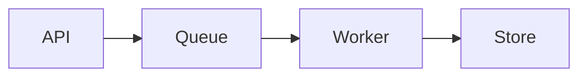
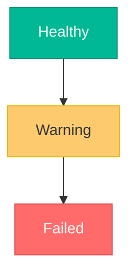
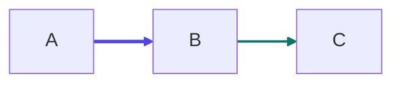

# Advanced Mermaid Features

Use this reference for configuration, theming, layout, styling, and export
choices that go beyond the diagram basics.

## Frontmatter Configuration

## Themes

- `default`: standard blue Mermaid theme
- `forest`: green-leaning palette
- `dark`: dark-surface palette
- `neutral`: grayscale presentation
- `base`: starting point for custom theme variables

## Layout and Look

Use `elk` for denser diagrams and `dagre` for simpler flowcharts.

## Styling Patterns

### Class-Based Styling

### Link Styling

## Export Notes

- use native rendering where the platform supports Mermaid
- use `mermaid.live` for quick SVG or PNG export
- use `mmdc -i input.mmd -o output.png` for repeatable CLI export
