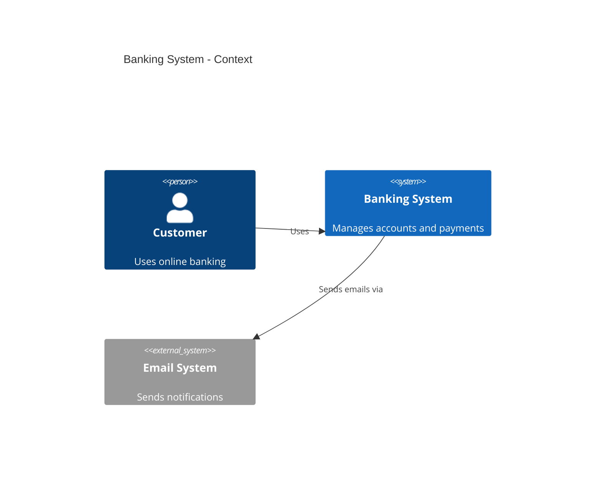
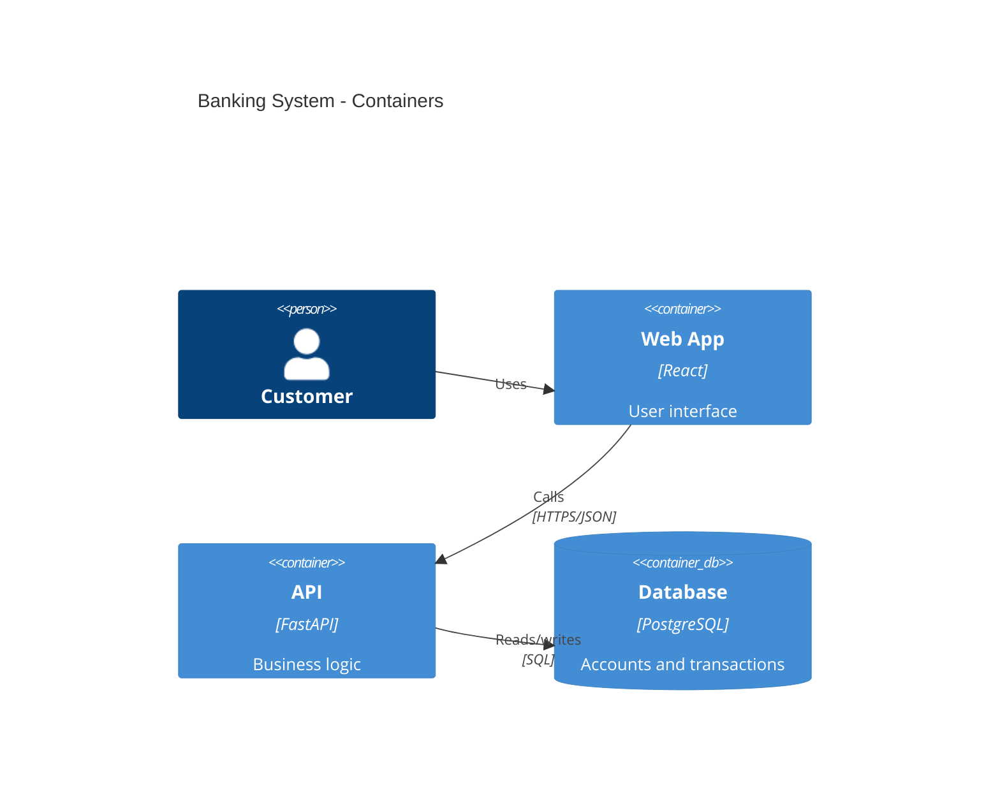
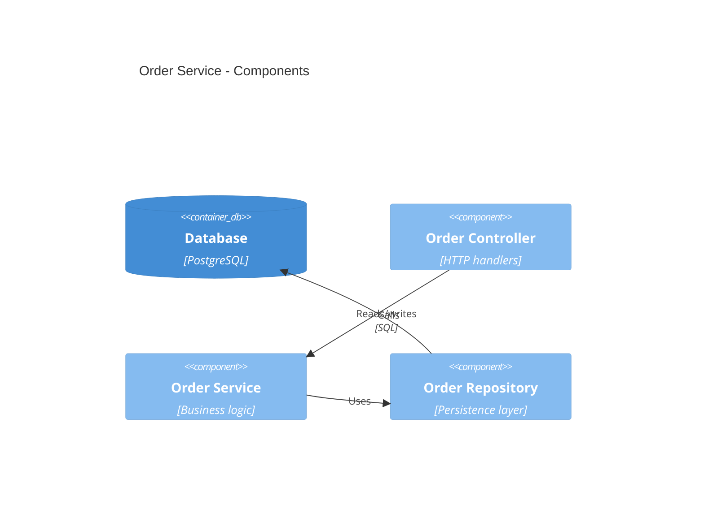
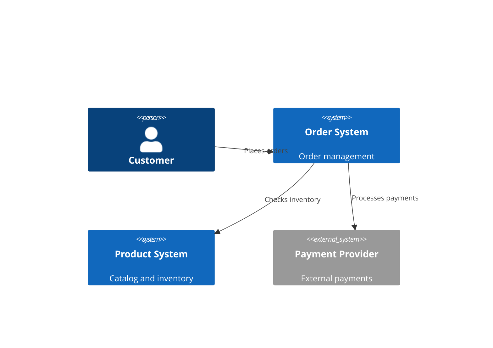
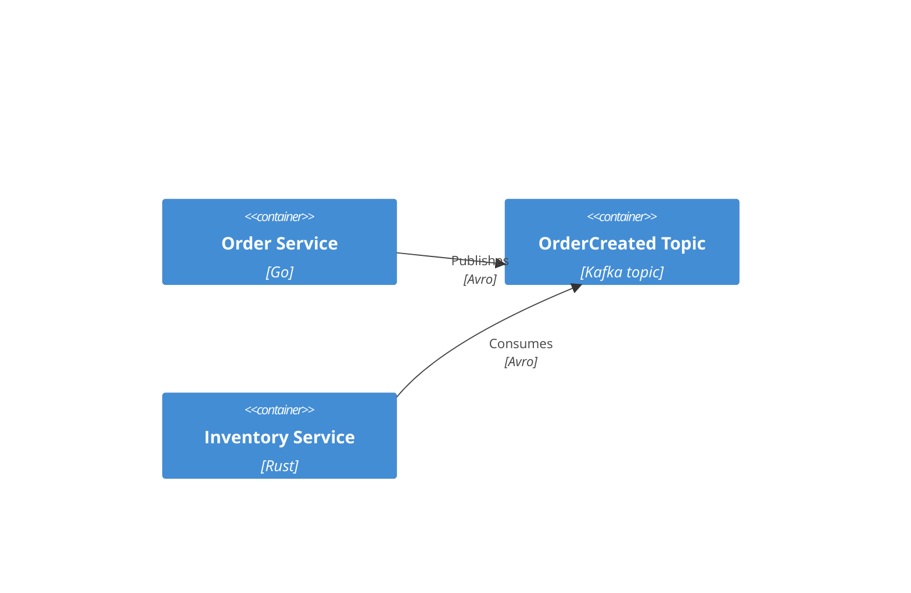
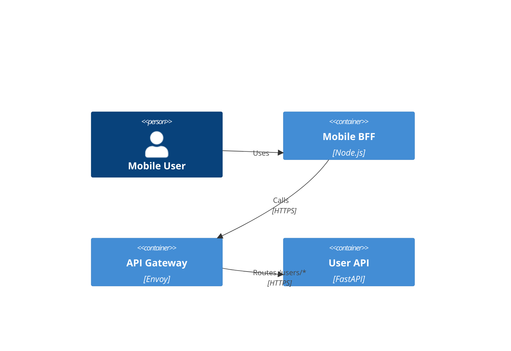

# C4 Model Diagrams

The C4 model gives you four architecture views at increasing levels of detail.

## C4 Levels

```text
1. Context    -> system and external actors
2. Container  -> apps, services, data stores, queues
3. Component  -> internal parts of one container
4. Code       -> regular code or class diagrams
```

Use the simplest level that answers the audience’s question.

## Context Diagram

Use this for:
- stakeholders
- product and platform alignment
- system boundaries and external dependencies



## Container Diagram

Use this for:
- application boundaries
- protocols between services
- databases, queues, and external integrations



## Component Diagram

Use this for:
- developer-facing service design
- internal responsibilities inside one container



## Common Patterns

### Multi-Team Microservices

At context level, separate team-owned domains can be modeled as systems:



### Event-Driven Containers

Model important topics separately instead of one generic “Kafka” box:



### API Gateway with BFF



## Best Practices

```text
Keep one clear story per diagram
Reuse the same names across levels
Add technology labels at container/component level
Use boundaries when they clarify ownership
Split diagrams before they become crowded
```

Rule of thumb:
- Context for broad relationships
- Container for deployment/runtime architecture
- Component for inside-one-service design
