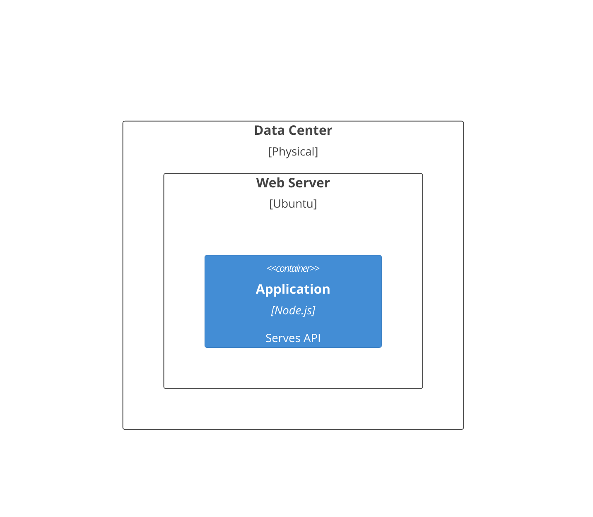

# C4 Elements

Use this reference for Mermaid C4 diagram declarations and element syntax.

## Diagram Types

| Type | Declaration | Purpose |
| --- | --- | --- |
| System Context | `C4Context` | system in environment |
| Container | `C4Container` | major technical building blocks |
| Component | `C4Component` | internals inside a container |
| Dynamic | `C4Dynamic` | request or event flow |
| Deployment | `C4Deployment` | infrastructure layout |

## Common Elements

```text
Person(alias, label, ?descr)
System(alias, label, ?descr)
System_Ext(alias, label, ?descr)
Container(alias, label, ?techn, ?descr)
ContainerDb(alias, label, ?techn, ?descr)
Component(alias, label, ?techn, ?descr)
Deployment_Node(alias, label, ?type, ?descr) { ... }
```

## Nested Deployment Nodes


