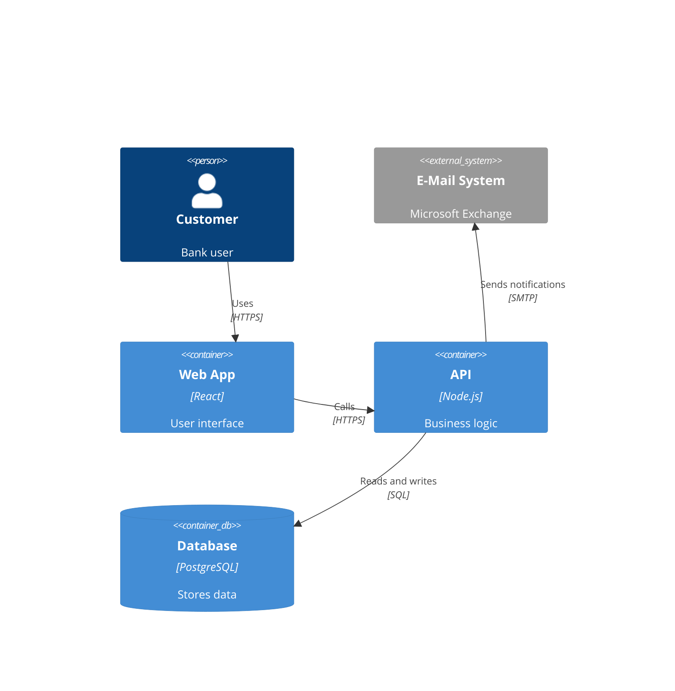

# C4 Examples and Limits

Use this reference for complete example shapes and Mermaid-specific caveats.

## Example Shapes

- system context for external actors and systems
- container diagrams for service decomposition
- component diagrams for container internals
- dynamic diagrams for request flow
- deployment diagrams for runtime topology

## Minimal Container Example

## Mermaid Limitations

Unsupported or weaker areas compared with PlantUML C4 include:

- custom sprites
- tags and tag styling
- autogenerated legends
- richer line-style controls
- explicit layout directives like `Lay_U` and `Lay_R`

If you need those features, consider Structurizr DSL or C4-PlantUML instead.
