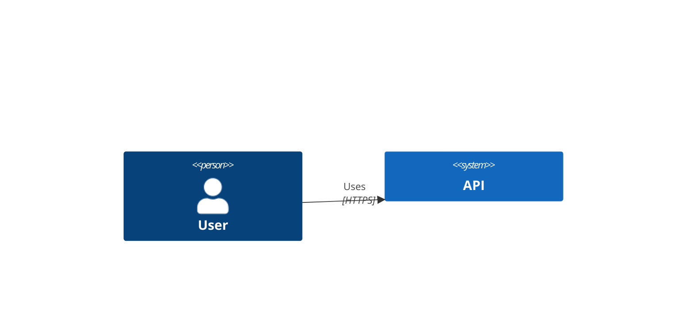

# C4 Layout and Styling

Use this reference for layout control and appearance tweaks.

## Element Styling

```text
UpdateElementStyle(elementAlias, $bgColor, $fontColor, $borderColor, $shadowing, $shape)
UpdateRelStyle(from, to, $textColor, $lineColor, $offsetX, $offsetY)
UpdateLayoutConfig($c4ShapeInRow, $c4BoundaryInRow)
```

## Label Offsets



## Layout Guidance

- reduce `c4ShapeInRow` to ease crowding
- reorder elements when Mermaid layout is awkward
- use relationship offsets sparingly for collisions
