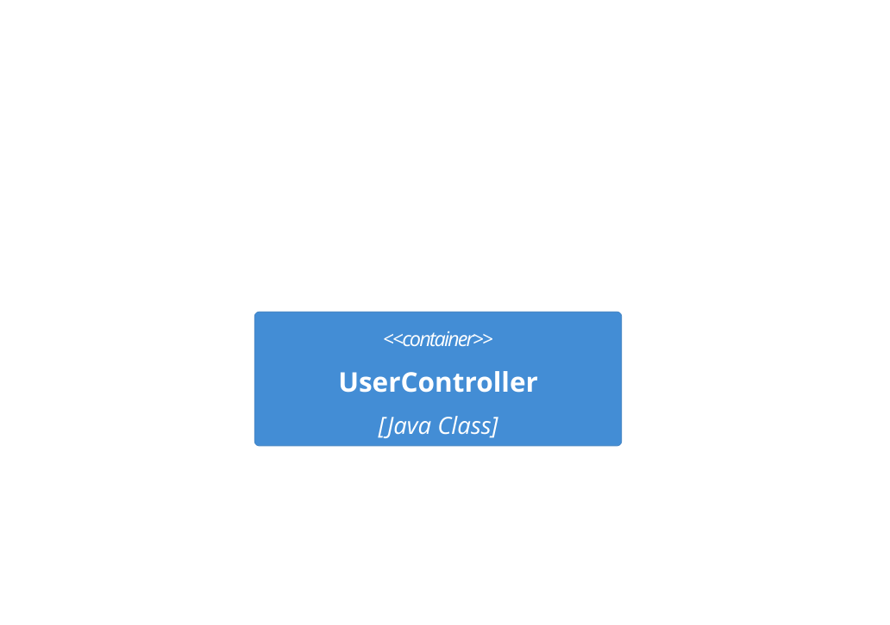

# Common C4 Model Mistakes

Use this reference to catch the most common C4 modeling errors before the
diagram gets shared.

## 1. Mixing Abstraction Levels

Do not show classes as containers or packages as systems.

Wrong:



Correct:


## 2. Inventing Extra C4 Levels

Stick to the standard layers: person, software system, container, component.
If you need class-level detail, switch to a code-level diagram instead of
inventing “level 3.5”.

## 3. Modeling Shared Libraries as Deployed Services

Libraries are bundled implementation details, not standalone runtime nodes.

Show the application that contains the library, or omit the library if it does
not help explain system behavior.

## 4. Hiding Message Flows Behind a Single Broker Box

A single “Kafka” or “RabbitMQ” box with every service pointing at it hides the
real business flow. Prefer topic-level or event-label relationships when the
event path matters.

## 5. Overmodeling External Systems

Treat third-party platforms as black boxes unless the external detail is the
actual subject of the diagram.

## 6. Vague Labels

Avoid labels like `Uses` or `Communicates with`. Prefer labels that say what
flows:

```text
Fetches products
Submits orders
Publishes payment.completed
```

## Practical Rules

- One diagram, one abstraction level.
- Use explicit element types and short descriptions.
- Prefer fewer boxes with clearer relationships over exhaustive inventories.
