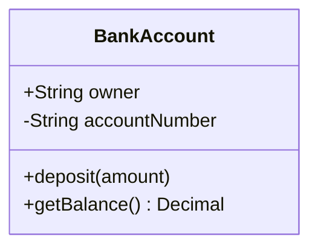
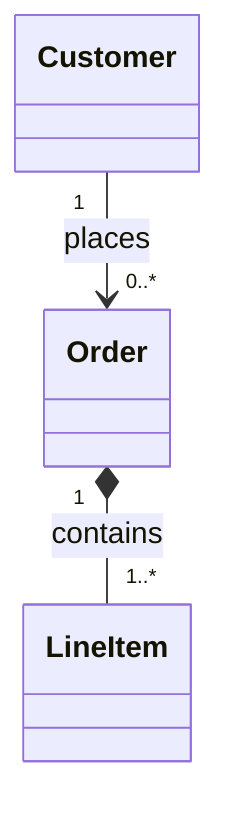

# Class Diagrams

Use Mermaid class diagrams for object models, domain relationships, and simple
type hierarchies.

## Basic Shape

## Relationships

- `--` association
- `*--` composition
- `o--` aggregation
- `<|--` inheritance
- `<|..` implementation

Use multiplicity when it clarifies the model:

## Good Uses

- domain model sketches
- service and entity relationships
- inheritance or interface structure

## Practical Rule

Class diagrams should explain structure, not every method in the codebase. Keep
members limited to the attributes and operations that matter to the discussion.
