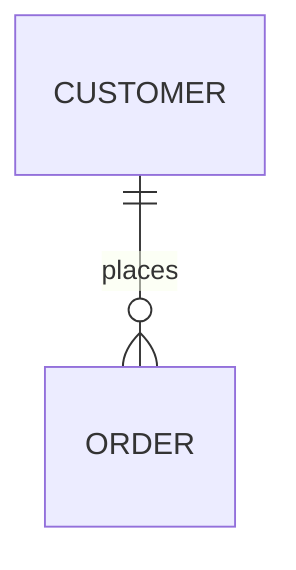
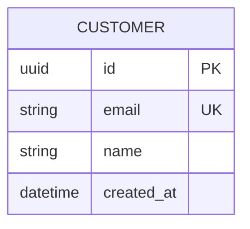
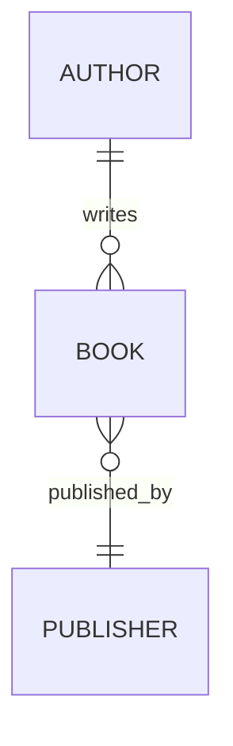
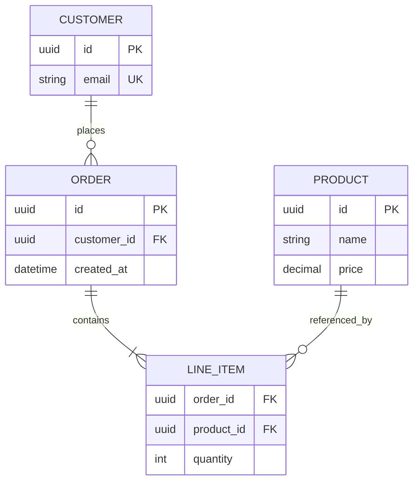

# Entity Relationship Diagrams

Use Mermaid ERDs to show tables, attributes, and cardinality clearly.

## Basic Syntax

## Entities and Attributes

Define attributes as `type name constraints`:

Common markers:

- `PK` primary key
- `FK` foreign key
- `UK` unique key
- `NN` not null

## Relationship Symbols

- `||` exactly one
- `|o` zero or one
- `}|` one or many
- `}o` zero or many

Use labels for the domain verb:

## Compact Example

## Practical Rules

- Use singular entity names.
- Show junction tables explicitly for many-to-many relationships.
- Model the cardinality you actually enforce, not the one you hope to enforce.
- Keep the diagram focused on schema structure, not every possible business
  rule.
