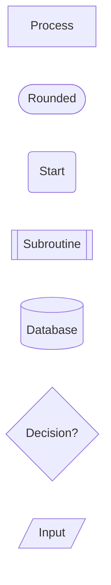
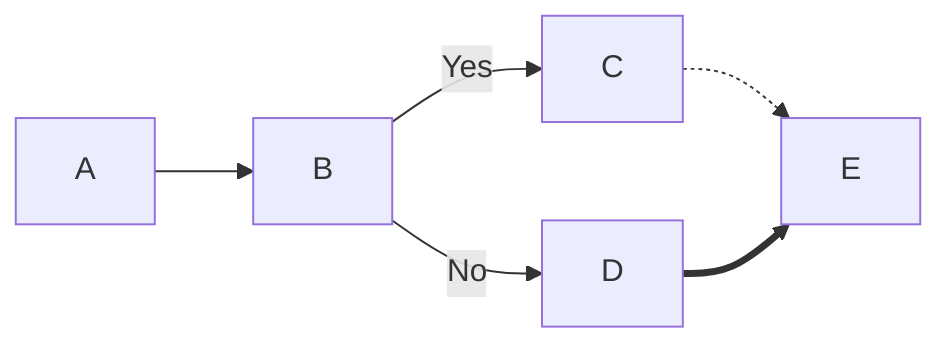
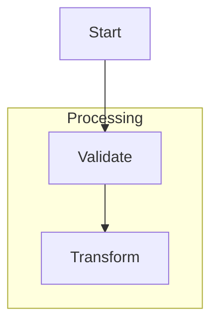
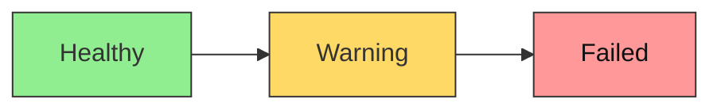
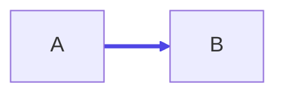
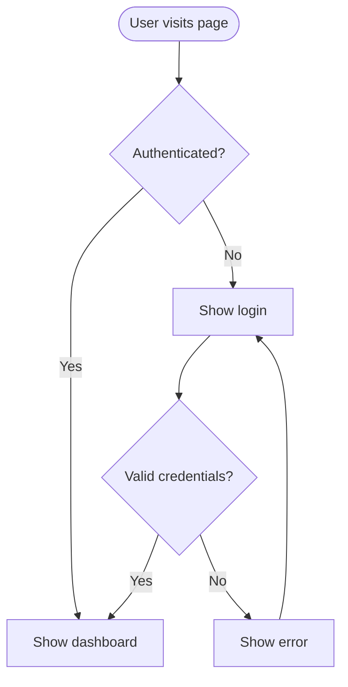

# Flowcharts

Use flowcharts for processes, decision trees, state-like user journeys, and
 algorithm sketches.

## Basic Syntax

Directions:

- `TD` or `TB`: top to bottom
- `BT`: bottom to top
- `LR`: left to right
- `RL`: right to left

## Common Node Shapes

## Connections

- `-->`: normal arrow
- `---`: open link
- `-.->`: dotted link
- `==>`: thick link

## Subgraphs

Use `direction` inside a subgraph when that section needs a different layout.

## Styling

### Class-Based

### Link Styling

## Example Pattern

## Practical Rule

If the flowchart starts looking like a full state machine or a dense systems
architecture, switch to a state diagram or C4 diagram instead of stretching
flowcharts past their natural fit.
