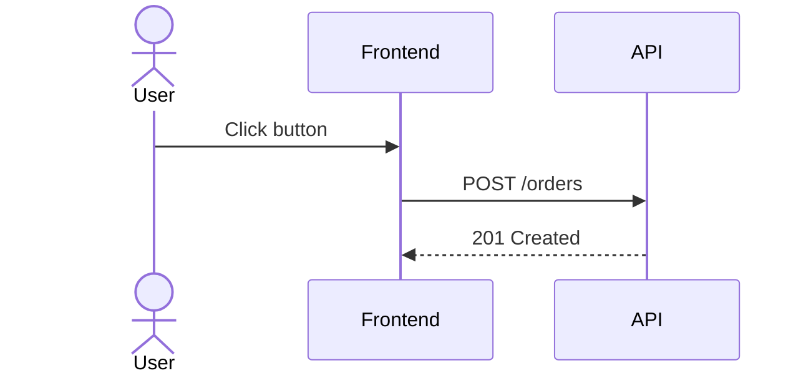

# Sequence Diagrams

Use sequence diagrams to show request flow, timing, and branching between
participants.

## Basic Shape

## Core Constructs

- `->>` request
- `-->>` response
- `-)` async send
- `+` activate participant
- `-` deactivate participant

## Control Blocks

Use:

- `alt` / `else` for branching
- `opt` for optional side paths
- `loop` for repeated actions
- `par` for concurrent work
- `break` for early exit

## Good Uses

- login and auth flows
- API request lifecycles
- distributed workflows with retries or branches
- async event publication and consumption

## Practical Rule

Keep the participant count low and the messages concrete. A sequence diagram
should explain a flow, not document the entire system.
